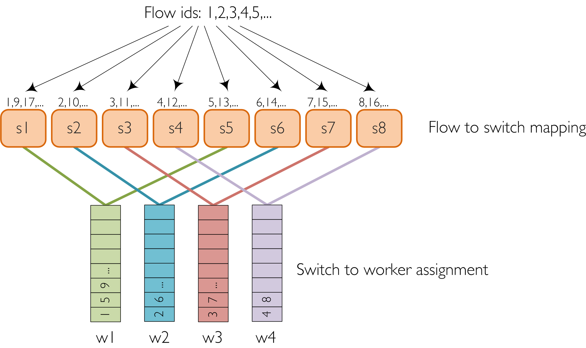

[](https://codeclimate.com/github/intracom-telecom-sdn/nstat-nb-generator)
[](https://travis-ci.org/intracom-telecom-sdn/nstat)
[](https://hub.docker.com/r/intracom/nstat-nb-generator/)

# NSTAT Northbound Generator

To provide a controllable and configurable method for generating and adding flows
to the Config DataStore via the NorthBound interface.

## Features

- **Delay before each RESTCONF call**: in this way we control how fast the
  requests are sent to the NorthBound interface of the controller.

- **Handler to start the generator and collect the returned results**: following
  the principle of decoupled architecture of NSTAT, for the integration of
  the NorthBound generator in NSTAT, we have developed and use a handler
  (`<NSTAT_src>/emulators/nb_generator/run_handler.py`).

## Nodes deployment

For using the NSTAT northbound generator, three nodes are necessary as mentioned
in Fig.... in NSTAT architecture.

*    the NSTAT northbound generator node,
*    the SDN controller node,
*    the SouthBound emulator node.

Since the NSTAT northbound generator is an external application used by NSTAT
and written in Python, a Dockerfile is provided under

```bash
<NSTAT-NB-GENERATOR_src>/deploy/docker/no_proxy
```

providing the ability to build a docker container image with all
necessary NSTAT nb-generator dependencies. In this case the Dockerfile

1.  builds an ubuntu:14.04 image
2.  downloads the ```deploy/provision.sh``` script when building the docker image
3.  executes the provision.sh within the docker image
3.1  the provision.sh has the ability to either install all NSTAT-nb-generator
dependencies directly on the image or
3.2 create a Python virtual environment and installing there, all NSTAT-nb-generator
 dependencies keeping in the way the ubuntu:14.04 image clean.


### Virtual environment

## Usage


For generating traffic to the controller's Config DataStore via the
NorthBound interface, follow these steps:

1. Start OpenDaylight controller
2. Start a Mininet network and connect it to the controller
3. Start the flow generator:

```bash
nb_gen.py [-h] --controller-ip CTRL_IP
               --controller-port CTRL_PORT
               --number-of-flows NFLOWS
               --number-of-workers NWORKERS
               --operation-delay OP_DELAY_MS
               [--delete-flows]
               [--discovery-deadline DISCOVERY_DEADLINE_MS]
               [--restconf-user RESTCONF_USER]
               [--restconf-password RESTCONF_PASSWORD]
               [--logging-level LOGGING_LEVEL]

  -h, --help            show this help message and exit
  --controller-ip CTRL_IP
                        The ip address of the controller.
                        This is a compulsory argument.
                        Example: --controller-ip='127.0.0.1'
  --controller-port CTRL_PORT
                        The port number of RESTCONF port of the controller.
                        This is a compulsory argument.
                        Example: --controller-port='8181'
  --number-of-flows NFLOWS
                        The total number of flow modifications.
                        This is a compulsory argument.
                        Example: --number-of-flows='1000'
  --number-of-workers NWORKERS
                        The total number of worker threads that will be created.
                        This is a compulsory argument.
                        Example: --number-of-workers='10'
  --operation-delay OP_DELAY_MS
                        The delay between each flow operation (in ms).
                        This is a compulsory argument.
                        Example: --operation-delay='5'
  --delete-flows        Flag defines if the type of operations will be
                        additions of flows or deletions of flows. If this flag
                        is used, an action of flow additions should have been
                        performed before.
                        Example: --delete-flag
  --discovery-deadline DISCOVERY_DEADLINE_MS
                        The deadline to discover flows (in ms).
                        The default value is '240000'.
                        Example: --discovery-deadline='240000'
  --restconf-user RESTCONF_USER
                        The controller's RESTCONF username.
                        The default value is 'admin'.
                        Example: --restconf-user='admin'
  --fpr FPR
                        Flows-per-Request - number of flows
                        (batch size) sent in each HTTP request.
                        Example: --fpr=10
  --restconf-password RESTCONF_PASSWORD
                        The controller's RESTCONF password.
                        The default value is 'admin'.
                        Example: --restconf-password='admin'
  --logging-level LOGGING_LEVEL
                        Setting the level of the logging messages.Can have one
                        of the following values:
                        INFO
                        DEBUG (default)
                        ERROR
```

If specified, the `--delete-flows` flag deletes all flows that have been
previously added.

The flow generator script returns the following values:
- number of failed flow operations. These are the operations that their
response status code was not 200 or 204

## NorthBound generator handlers

The NorthBound generator can be used by NSTAT through a handler. We have only
one handler `run_handler.py` under the path `<NSTAT_src>/emulators/nb_generator/`.
It takes the following command line arguments:
  1. IP address of controller
  2. controller REST interface port (port on which the NorthBound
    controller's interface listens for REST requests)
  3. total number of requests for Flow modifications that will be performed.
    The supported requests for Flow modifications are addition of new flows
    and deletions of the corresponded flows. These requests are distributed
    to the flow worker threads.
  4. number of flow worker threads to create
  5. delay between thread operations (in milliseconds)
  6. whether to delete or not the added flows (can have the values 'True' or
    'False')
  7. controller NorthBound REST interface username
  8. controller NorthBound REST interface password
  9. flows per request, the number of flows that will be sent in a single
  request
  10. NorthBound generator logging level (Can be DEBUG, INFO or ERROR. The
    default value is DEBUG)

## Design

A Flow-Master thread distributes all flow operations to a number of
Flow-Worker threads to write them to the controller's Config DataStore via
the NorthBound REST interface. The worker threads are synchronized so that the
REST requests are being sent simultaneously. After all flows have been sent, the
worker threads join inside the Flow-Master returning their partial results (the
number of failed REST requests). Subsequently, the Flow-Master polls the
Operational DataStore to discover the flows that have been successfully installed,
until the expected number is reached.

The time between the initiation of REST requests from the worker threads and the moment
when all flows have been reflected to the Operational DataStore, is considered the flow
installation time.

### Flow operations generation and scheduling

The generated flows are created based on the following json template and each
has a unique flow id. These flows are added or deleted to a topology of switches
connected on the SouthBound interface of the controller.
```json
{
    "cookie": %d,
    "cookie_mask": 4294967295,
    "flow-name": "%s",
    "hard-timeout": %d,
    "id": "%s",
    "idle-timeout": %d,
    "installHw": true,
    "priority": 2,
    "strict": false,
    "table_id": 0,
    "match": {
        "ipv4-destination": "%s/32",
        "ethernet-match": {
            "ethernet-type": {
                "type": 2048
            }
        }
    },
    "instructions": {
        "instruction": [
            {
                "apply-actions": {
                    "action": [
                        {
                            "drop-action": {},
                            "order": 0
                        }
                    ]
                },
                "order": 0
            }
        ]
    }
}
```
On the above template all elements with % are configurable parameters. For the
above mentioned template as well as the generation installation and deletion
functions of flows, we were based on
[Jan Medved's](https://github.com/opendaylight/integration/tree/master/test/tools/odl-mdsal-clustering-tests/clustering-performance-test)
original scripts.

The total number of flows, are distributed among the Flow-Worker threads.
There is a scheduling function that distributes equally the total operations
among `Workers`, following a round robin algorithm.

Each `Worker` gets a dictionary, which has elements of keys and flows. The key
is the id of the switch, on which the corresponded flow will be added or
deleted. Total flows are distributed equally among the total switches. This
distribution is also made by the scheduling function that makes the
distribution of flows to Flow-Worker threads and is made in a way that the
same `Worker thread` will make additions and the equivalent deletion operations
on the same switches.

An example of how distribution of flows is done on workers and switches is
depicted in the following figure. In this case depicted, we have four workers,
8 switches and n number of flows, which should be greater than the number of
switches or else some switches will remain without flows.


